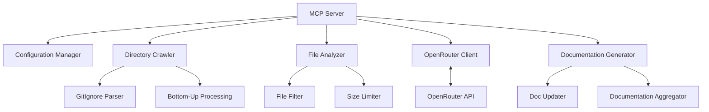
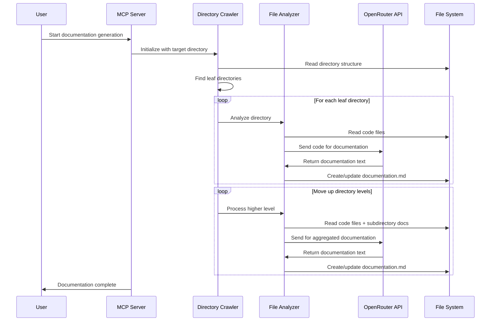

# Automatic Documentation Generator MCP Server Plan

## System Architecture



## Core Components

### 1. Directory Crawler
- Recursively traverses directories respecting `.gitignore` patterns
- Identifies leaf directories (those with no subdirectories)
- Implements bottom-up processing logic

### 2. File Analyzer
- Filters files based on configurable extensions (defaults: .ts, .js, .tsx, .jsx)
- Reads file contents and prepares them for LLM processing
- Implements file size and count limits

### 3. OpenRouter Client
- Manages API requests to OpenRouter
- Configurable model selection (default: Claude 3.7)
- Handles rate limiting and error cases

### 4. Documentation Generator
- Creates/updates documentation.md files
- Aggregates documentation from subdirectories
- Creates undocumented.md for directories exceeding size/count limits

### 5. Configuration Manager
- Handles API keys and model settings
- Manages file extension configuration
- Controls size limits and other operational parameters

## Implementation Plan

### Phase 1: MCP Server Setup
- Create basic server structure
- Implement configuration handling
- Set up OpenRouter client integration

### Phase 2: Core Functionality
- Implement directory crawler with gitignore support
- Build file analyzer with filtering capabilities
- Create documentation generator logic

### Phase 3: Documentation Processing
- Implement bottom-up processing workflow
- Develop documentation aggregation system
- Create undocumented.md handling

### Phase 4: Testing & Enhancement
- Test with various directory structures
- Optimize for performance with large codebases
- Add error handling and recovery mechanisms

## Technical Details



## Configuration Options

The MCP server will support the following configurable options:

1. **OpenRouter Settings**
   - API key
   - Model selection (default: Claude 3.7)
   - Request parameters (temperature, etc.)

2. **File Processing**
   - Code file extensions (default: .ts, .js, .tsx, .jsx)
   - Max file size (KB)
   - Max files per directory

3. **Documentation Settings**
   - Output filename (default: documentation.md)
   - Fallback filename (default: undocumented.md)
   - Documentation style/format

## Folder Structure

```
autodocument/
├── package.json
├── tsconfig.json
├── src/
│   ├── index.ts              # Main MCP server entry point
│   ├── config.ts             # Configuration management
│   ├── crawler/
│   │   ├── index.ts          # Directory crawler implementation
│   │   └── gitignore.ts      # GitIgnore parser
│   ├── analyzer/
│   │   ├── index.ts          # File analyzer
│   │   └── filters.ts        # File filtering utilities
│   ├── openrouter/
│   │   └── client.ts         # OpenRouter API client
│   └── documentation/
│       ├── generator.ts      # Documentation generator
│       └── aggregator.ts     # Documentation aggregator
├── tests/                    # Test files
└── README.md                 # Project documentation
```

## Next Steps

1. Set up the project structure and dependencies
2. Implement the core MCP server functionality
3. Develop the directory crawler with gitignore support
4. Create the OpenRouter client integration
5. Build the documentation generation system
6. Implement the bottom-up processing logic
7. Add configuration options and error handling
8. Test with various repository structures